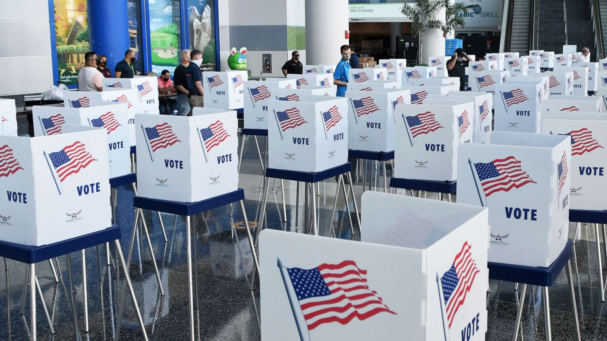

# Solo 322 - Understanding voting in America

- Survey (poll) results studied to identify a variety of factors about American voters.

## Milestones

Details for Milestone are available on Canvas (left sidebar, Course Project) or [here](https://firas.moosvi.com/courses/data301/project/milestone01.html).

## Describe your topic/interest in about 150-200 words

The available poll data provides an opportunity for understanding the voting habits of Americans in detail and its beauty lies, especially, in the extensive number of variables (a lot of questions) recorded as a part of the study. Interestingly, it is this vastness of recorded variables that allows for answering ample research questions by analysis of patterns and connections between preferences of each respondent and their voting habits; however, the focus of this project would only be centred on answering certain questions in this regard. While the responses to each question and situation would be taken into consideration during analysis, patterns and connection would only be established where necessary, to provide reasoning for the research topic/questions under attention. These include the following:
-	Do Americans realize the importance of voting?
-	How often do they participate in voting?
-	Potential barriers to fair participation in voting practices.
-	Impact of demographic factors on the frequency of participation in voting.
Some additions may be made to this while moving forward with the analysis. The data seems to provide enough compatibility for being transformed into a user-facing Dashboard as there are a lot of patterns that can be established among multiple factors.

*Paul Hennessy/NurPhoto via Zuma Press*
*Election workers set up voting booths at an early voting site at the Amway Center, Oct. 15, 2020, in Orlando, Florida.*

## Describe your dataset in about 150-200 words

The data has been obtained from a poll conducted by Ipsos for [FiveThirtyEight](https://data.fivethirtyeight.com/). It includes the responses of 5836 American voters, who have been eligible for at least four elections, to a series of questions ranging from their basic characteristics (i.e. age, race, education, etc.) to their views and experiences regarding voting practices. The pdf file under raw data illustrates the questions asked as a part of the poll where numerous poll questions had sub-questions asking the respondents to epitomize their views on certain statements in the form of pre-defined numeric values. These provide, for each respondent, the information about their frequency of voting, plausible reasons for not voting in case of non-frequent voters, understanding of the importance of voting, etc. The poll was conducted from September 15, 2020, to September 25, 2020, by Ipsos where the respondents consisted of Ipsos’s KnowledgePanel i.e. a probability-based online panel recruited to be a representative of the American population. The responses were collected for analytical purposes where some respondents, who had only been eligible to vote for three or fewer elections, were removed from a total of 8327 respondents, to get a more representative sample.

## Project by

- **Aashish Raizada**

## References

- [data-source](https://github.com/fivethirtyeight/data/tree/master/non-voters)
- [image-source](https://abcnews.go.com/Politics/florida-begins-person-voting-million-votes-cast-mail/story?id=73654825)
